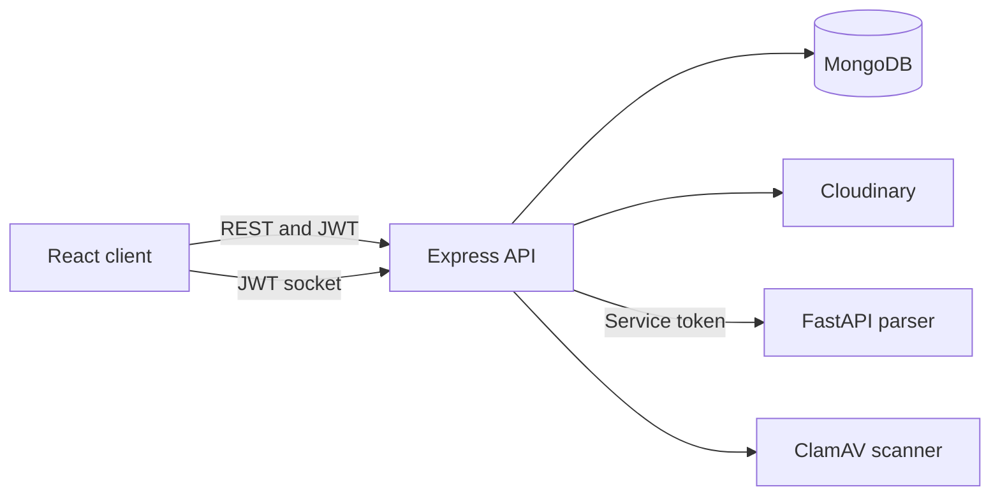

# JobPortal

A candidate and recruiter application built with React, Express, MongoDB and Socket.IO. Candidates can browse jobs, save listings, upload a PDF resume, apply, and track applications. Recruiters can post jobs, review applicants, update statuses, and chat with candidates who applied.

This is an implementation and learning project. The matching score is **case-insensitive skill overlap**, and resume extraction uses a **fixed dictionary and PDF text parsing**. Neither is a trained ranking model. See [Production checklist](#production-checklist) for steps requiring live services or account access.

## At a glance

| Area | Stack | Responsibility |
| --- | --- | --- |
| Web | React 19, Vite, Redux Toolkit, React Router, Tailwind CSS | Candidate and recruiter screens; route-level code splitting |
| API | Node 20, Express 4, Mongoose, Socket.IO | JWT authentication, ownership checks, jobs, applications, chat and PDF upload |
| Data | MongoDB | Users, jobs, applications and messages |
| Resume storage | Cloudinary authenticated assets | PDFs accessible through short-lived signed download links |
| Extraction | Python 3.12, FastAPI, PDFMiner | Optional skill and contact extraction behind a shared service token |
| Upload scanning | ClamAV `clamscan` | Required and fail-closed when `NODE_ENV=production` |



The API owns authorization. The frontend is never trusted to supply a candidate ID, recruiter ID, stored resume URL or chat sender. Socket connections authenticate with a JWT and can message only a user linked by an application. The optional parser can fail without losing an otherwise valid, scanned upload.

## Repository map

| Path | Contents |
| --- | --- |
| `backend/` | Express routes, controllers, Mongoose models, socket gateway and Node tests |
| `frontend/job-portal/` | React application, Redux slices and Vite build |
| `ai-service/` | FastAPI PDF parser and Python tests |
| `docs/API_REFERENCE.md` | Route and access reference |
| `docs/ARCHITECTURE.md` | Request flows, trust boundaries and limitations |
| `docs/USER_GUIDE.md` | Candidate and recruiter walkthrough |
| `.github/workflows/ci.yml` | Backend, frontend, parser and dependency audit checks |

## Local development

**Prerequisites:** Node.js 20, npm, Python 3.12, a running MongoDB instance and a Cloudinary account. ClamAV is optional for local experiments, but mandatory for production uploads. Use your own credentials; do not reuse values exposed in old Git commits.

1. Create `backend/.env` from [`backend/.env.example`](backend/.env.example). Set `MONGO_URI`, a random `JWT_SECRET` of at least 32 characters, `CLIENT_ORIGIN=http://localhost:5173`, and Cloudinary credentials. For parsing, set `AI_SERVICE_URL=http://localhost:8000` and a distinct random `AI_SERVICE_TOKEN`.
2. Create `ai-service/.env` from [`ai-service/.env.example`](ai-service/.env.example), with the **same** `AI_SERVICE_TOKEN`. FastAPI does not automatically read this file: export it in the shell before starting Uvicorn.
3. Start the three processes in separate terminals from the repository root:

   ```bash
   cd backend
   npm ci
   npm run dev
   ```

   ```bash
   cd ai-service
   python -m venv .venv
   # Activate .venv for your shell, then:
   pip install -r requirements.txt
   export AI_SERVICE_TOKEN="your-backend-token"  # PowerShell: $env:AI_SERVICE_TOKEN="..."
   uvicorn app.main:app --host 127.0.0.1 --port 8000
   ```

   ```bash
   cd frontend/job-portal
   npm ci
   npm run dev
   ```

4. Open `http://localhost:5173`. The API is at `http://localhost:5000/api`; `/health` checks the process and `/ready` checks MongoDB connectivity. Set `VITE_API_URL` to a different API base URL **including `/api`** when the frontend and API are on different origins. Build time values are baked into the Vite bundle.

The parser is optional: if it is unavailable, a valid uploaded PDF is stored and the response says `parsingAvailable: false`. Without Cloudinary credentials, uploads cannot succeed. Set `CLAMSCAN_COMMAND=clamscan` in the backend environment to scan local uploads too; install ClamAV and update its signature database first.

## Typical flows

1. A candidate registers, uploads a PDF of up to 5 MB, saves interesting jobs and applies. An application copies the resume asset identifier at submission time. Replacing the candidate's current resume does not change an earlier application.
2. A recruiter registers, saves a company profile, posts a job and reviews its applications. The recruiter can access a candidate resume only through an application they own. The API creates a signed download link valid for five minutes.
3. Candidates and recruiters linked by an application can exchange messages. The server derives the sender from the verified socket session and stores messages in MongoDB.

The UI filters the currently loaded jobs by title, company, skill, location and job type. The public API supports `q` for title, `location` and `skill`; results are currently returned as an unpaginated array.

## Configuration

| Variable | Service | Purpose |
| --- | --- | --- |
| `MONGO_URI` | API | MongoDB connection string |
| `JWT_SECRET` | API | JWT signing key; at least 32 characters in production |
| `CLIENT_ORIGIN` | API | Comma-separated allowed browser origins for CORS and sockets |
| `CLOUDINARY_CLOUD_NAME`, `CLOUDINARY_API_KEY`, `CLOUDINARY_API_SECRET` | API | Authenticated PDF upload and signed download |
| `CLAMSCAN_COMMAND` | API | Path to `clamscan`; required in production; errors and detections block uploads |
| `AI_SERVICE_URL`, `AI_SERVICE_TOKEN` | API | Optional parser URL and token; token must match the parser |
| `AI_SERVICE_TOKEN` | Parser | Rejects requests without the shared token |
| `VITE_API_URL` | Web | API base URL, including `/api`; default `http://localhost:5000/api` |
| `SMTP_HOST`, `SMTP_EMAIL`, `SMTP_PASSWORD` | API | Optional welcome mail on registration |

Do not commit `.env` files. The root ignore file excludes them, including new nested environment files. The parser should be reachable only by the API in deployment; its token is an additional boundary, not a reason to expose it publicly.

## API and authorization

| Action | Endpoint | Allowed caller |
| --- | --- | --- |
| Register and sign in | `POST /api/auth/register`, `/api/auth/login` | Public, rate limited |
| Read/update own profile | `GET/PATCH /api/auth/me` | Signed-in user |
| Browse jobs and view details | `GET /api/jobs`, `/api/jobs/:id` | Public |
| Post or delete a job | `POST /api/jobs`, `DELETE /api/jobs/:id` | Recruiter; delete requires ownership |
| Save or remove a job | `GET /api/jobs/saved`, `PUT/DELETE /api/jobs/:id/save` | Candidate |
| Apply and view own applications | `POST /api/applications`, `GET /api/applications/my` | Candidate |
| Review applicants or change status | `GET /api/applications/job/:jobId`, `PUT /api/applications/:id/status` | Owning recruiter |
| Upload or view own resume | `POST /api/resume/upload`, `GET /api/resume/mine` | Candidate |
| View applicant resume | `GET /api/resume/applications/:id` | Recruiter who owns the application |
| Chat history and read receipts | `GET /api/chat/:userId`, `PUT /api/chat/read/:userId` | Application participants |

Authenticated HTTP calls use `Authorization: Bearer <JWT>`. Resume GET endpoints return `{url, expiresAt}` after authorization; do not persist or share those links. See the [full API reference](docs/API_REFERENCE.md) for fields and status codes.

## Verification

```bash
(cd backend && npm ci && npm audit --audit-level=high && npm test)
(cd frontend/job-portal && npm ci && npm audit --audit-level=high && npm run lint && npm run build)
pip install -r ai-service/requirements.txt pytest
PYTHONPATH=ai-service python -m pytest -q ai-service/tests
```

Run these commands from the repository root. CI executes these checks on pushes and pull requests. API tests stub the database and Cloudinary rather than testing live accounts. The private download, malware scan failure and ownership boundaries have focused tests, but a live service smoke test is still necessary before launch.

## Production checklist

- **Rotate historical credentials.** An older commit included `backend/.env`. Rotate MongoDB, JWT, Cloudinary and SMTP credentials in the relevant accounts. Deleting or rewriting Git history alone cannot revoke them. The repository cannot perform rotations on your behalf.
- **Provision a scanner.** Install `clamscan`, keep signatures current with `freshclam` and set `CLAMSCAN_COMMAND` on the API host. Production uploads reject files if scanning is unavailable or detects malware. The included `render.yaml` is only a deployment starting point: a bare Node host without ClamAV will not accept uploads.
- **Migrate old resumes.** Previous uploads used public Cloudinary URLs. Existing users must reupload to gain authenticated storage. Remove or restrict legacy public assets in Cloudinary and decide how to handle legacy applications whose old public links are no longer returned by the API. This requires account access and a data retention decision.
- **Configure and smoke test live services.** Check MongoDB indexes, Cloudinary PDF delivery restrictions, SMTP if used, parser connectivity, CORS, `/ready`, signup, PDF upload/download, application ownership, chat and status changes on the deployed domains. An existing database may need duplicate `(jobId, candidateId)` rows resolved before its unique index can build.
- **Harden the session model for public deployment.** JWTs are stored in browser localStorage and last 30 days; an XSS compromise can expose them. Consider shorter sessions and HttpOnly cookie authentication with appropriate CSRF protection. Configure an explicit CSP at the hosting layer for the actual API origin.
- **Plan capacity and retention.** Listings and recommendations are unpaginated; uploads and applicant data need a retention and deletion policy, monitoring, backups and rate limits appropriate to actual traffic.

## Troubleshooting

| Symptom | Check |
| --- | --- |
| API `/health` works but `/ready` is 503 | MongoDB connection or `MONGO_URI` |
| Upload returns 503 in production | `clamscan` availability, `CLAMSCAN_COMMAND` and updated signatures |
| Resume link returns 404 | A legacy public upload must be reuploaded as an authenticated asset |
| PDF download fails after access succeeds | Cloudinary credentials or account PDF delivery restrictions; signed links expire after five minutes |
| Skills do not appear | Parser process, identical service tokens, URL and logs; upload may still succeed |
| Web app cannot reach API/socket | Build time `VITE_API_URL`, API `CLIENT_ORIGIN`, HTTPS and host CSP |

## Maintainer and license

Maintained by [Pinak Chimurkar](https://github.com/splash0047). A repository-level license has not yet been selected; do not assume permission to reuse the source outside GitHub's default terms.
