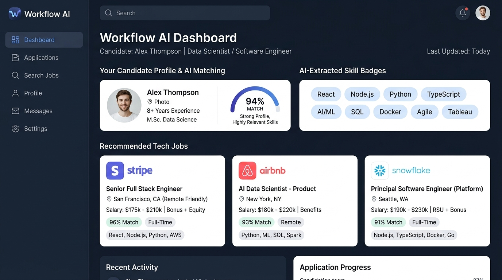
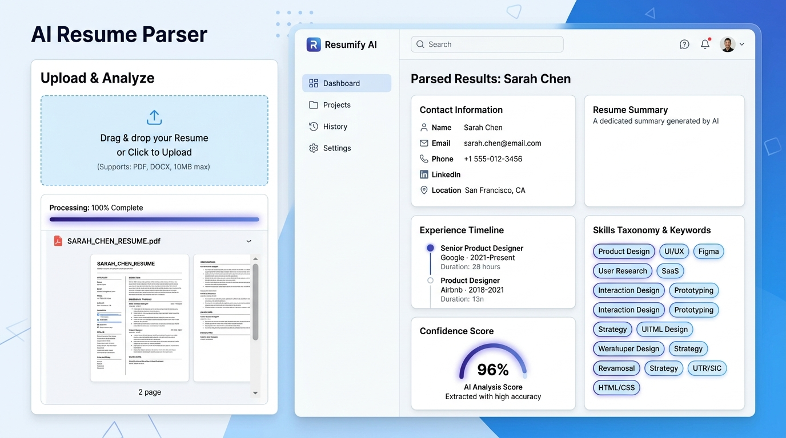
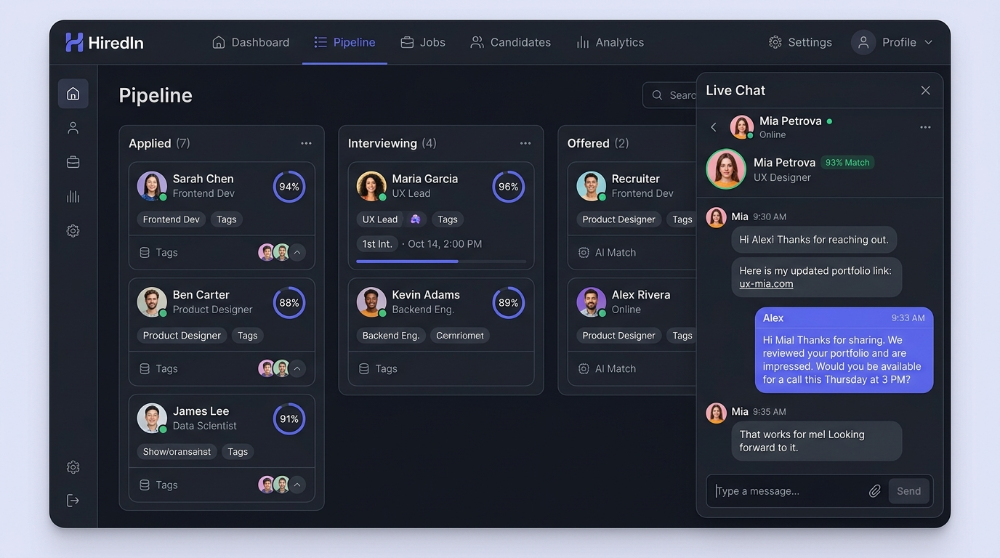
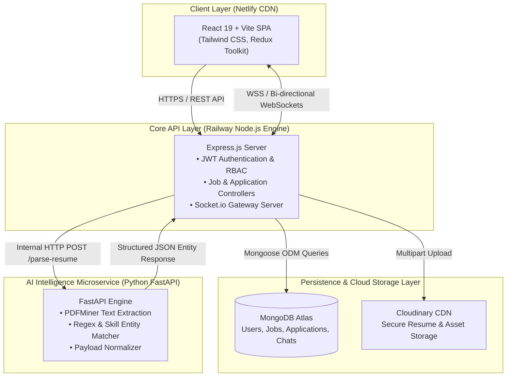

# 💼 WorkFlow AI — Intelligent Job Portal & Automated Resume Analyzer

[](https://opensource.org/licenses/MIT)
[](https://nodejs.org/)
[](https://fastapi.tiangolo.com/)
[](https://react.dev/)
[](https://www.mongodb.com/)
[](https://socket.io/)

> **A full-stack, microservices-driven hiring platform that connects candidates and recruiters using automated NLP resume parsing, smart skill matching, and instant real-time messaging.**

---

## 📸 Product Screenshots & Visual Walkthrough

| Candidate Intelligence Dashboard | AI Resume Parsing & Entity Extraction |
| :---: | :---: |
|  |  |
| *Candidate home: AI match scoring, skill badges, and personalized job feed.* | *Automated CV parsing: Text extraction, entity recognition, and ATS confidence score.* |

<br/>

| Recruiter Candidate Pipeline & Real-Time Chat |
| :---: |
|  |
| *Recruiter workflow: Kanban-style applicant stages, AI match badges, and real-time Socket.io messaging.* |

---

## 📌 Table of Contents

- [The Problem & Solution](#-the-problem)
- [Product Screenshots](#-product-screenshots--visual-walkthrough)
- [Key Features](#-key-features)
- [System Architecture](#-system-architecture)
- [Technology Stack & Rationale](#-technology-stack--rationale)
- [How It Works (Data Pipeline)](#-how-it-works-data-pipeline)
- [API Documentation](#-api-documentation)
- [Sample Input & Output](#-sample-input--output)
- [Local Setup & Installation](#-local-setup--installation)
- [Environment Variables](#-environment-variables)
- [Project Directory Structure](#-project-directory-structure)
- [Technical Trade-offs & Limitations](#-technical-trade-offs--limitations)
- [Future Roadmap](#-future-roadmap)
- [Author & Contributions](#-author--contributions)

---

## 🛑 The Problem

Traditional job application platforms face several critical friction points:

1. **Recruiter Overload**: Screening hundreds of unstructured PDF resumes manually wastes dozens of hours per job listing.
2. **Keyword Mismatches**: Candidates often don't know whether their resumes reflect the required technical competencies for a role.
3. **Fragmented Communication**: Recruiters and applicants are forced off-platform to email or third-party messengers, causing dropped applications and slow hiring loops.
4. **Monolithic Inefficiencies**: Heavy NLP text extraction operations slow down standard web API responsiveness when packaged within a monolithic backend.

### 💡 The Solution

**WorkFlow AI** addresses these problems with a decoupled microservice architecture:
- **Instant Resume NLP Parsing**: Uploaded PDF resumes are ingested by a specialized Python FastAPI microservice that extracts contact information, normalized technical skills, and experience snippets in milliseconds.
- **Automated Skill Alignment**: Extracted candidate skills are mapped against active job requirements to offer instantaneous job recommendations.
- **Integrated Real-Time Chat**: Direct WebSockets (Socket.io) messaging allows employers and applicants to converse instantly without leaving the portal.
- **High-Performance Decoupled Architecture**: Separation of UI (React/Vite on CDN), Core API (Express/MongoDB), and heavy computing (FastAPI/PDFMiner) prevents blocking event loops.

---

## 🚀 Key Features

### For Candidates (Job Seekers)
- 📄 **One-Click AI Resume Extraction**: Upload PDF/DOCX resumes to auto-populate profile credentials and skills.
- 🎯 **Skill-Matched Recommendations**: Discover curated jobs scored against extracted skills.
- 📬 **Live Application Tracking**: Real-time status updates (`applied`, `reviewing`, `shortlisted`, `rejected`).
- 💬 **Direct Recruiter Messaging**: Real-time chat powered by Socket.io with unread indicators.

### For Recruiters (Employers)
- 📝 **Comprehensive Job Posting**: Create structured postings with compensation brackets, required skills, and job categories.
- 👥 **Applicant Review Pipeline**: Inspect candidate profiles, extracted skill lists, and download original resumes hosted on Cloudinary.
- ⚡ **Status Management**: Instantly transition candidate application stages.
- 💬 **Candidate Direct Messaging**: Instant back-and-forth communication channel for interview scheduling.

---

## 🏗️ System Architecture



### Architecture Highlights
- **Split-Host Deployment**: Frontend hosted on Netlify Edge CDN for sub-50ms TTFB worldwide; backend and microservices hosted on isolated container runtimes.
- **Asynchronous File Handling**: The Node.js server buffers uploaded resumes into memory/temp streams, dispatches raw streams to the FastAPI microservice for immediate extraction, and synchronizes persistent storage with Cloudinary.
- **Fail-Safe Fallbacks**: If the AI Microservice experiences downstream latency or failure, the Node.js API gracefully logs a warning, preserves the candidate upload, and allows manual skill entry.

---

## ⚙️ Technology Stack & Rationale

| Layer | Technology | Why This Technology Was Chosen |
| :--- | :--- | :--- |
| **Frontend** | **React 19 & Vite** | Lightning-fast HMR build times, concurrent rendering improvements, and lightweight footprint compared to legacy Webpack setups. |
| **State Management** | **Redux Toolkit** | Centralized, predictable global state for authentication tokens, active chat sessions, and asynchronous job filtering. |
| **Styling & UI** | **Tailwind CSS + Framer Motion** | Utility-first CSS for rapid, maintainable design system tokenization; fluid micro-interactions for elevated UX. |
| **Backend API** | **Node.js & Express.js** | Non-blocking I/O model ideal for high-throughput API gateway routing, auth middleware, and WebSocket connection lifecycle management. |
| **AI Microservice** | **Python 3.10 + FastAPI** | Python possesses the richest ecosystem for NLP/text processing. FastAPI provides high-speed asynchronous endpoint execution via `uvicorn` and automatic OpenAPI schema validation. |
| **Database** | **MongoDB Atlas & Mongoose** | Flexible document model accommodates dynamic resume schemas, evolving applicant profiles, and nested job metadata without costly migrations. |
| **Real-time Engine** | **Socket.io** | Reliable bi-directional event-driven communication with automatic reconnection, rooms support for recruiter-candidate threads, and fallback mechanisms. |
| **Asset Storage** | **Cloudinary** | Secure media CDN offloading resume storage, transformation, and virus-scanned delivery away from application servers. |

---

## 🔄 How It Works (Data Pipeline)

```
[Candidate PDF Resume]
        │
        ▼
[Frontend: Dropzone Upload] ──(POST Multipart/Form-Data)──► [Node.js Backend]
                                                                    │
                                   ┌────────────────────────────────┴────────────────────────────────┐
                                   ▼                                                                 ▼
                         [FastAPI Microservice]                                              [Cloudinary CDN]
                                   │                                                                 │
                    (PDFMiner Extraction + Regex)                                          (Permanent Cloud URL)
                                   │                                                                 │
                       [Extracted Structured JSON]                                                   │
                                   │                                                                 │
                                   └────────────────────────────────┬────────────────────────────────┘
                                                                    ▼
                                                       [MongoDB User Profile Update]
                                                                    │
                                                                    ▼
                                                     [Real-Time Dashboard UI Update]
```

1. **Upload & Ingestion**: The applicant uploads their CV in `.pdf` format.
2. **Microservice Delegation**: Express receives the multipart file and proxies the payload to `http://ai-service:8000/parse-resume`.
3. **Text Extraction & Cleaning**: FastAPI runs PDFMiner to strip binary streams into normalized UTF-8 text strings, cleans whitespace, and suppresses control characters.
4. **Entity Extraction**: Regex pattern tokenizers extract emails, phone numbers, and match technical competencies against a curated skill lexicon.
5. **Persistence**: The original resume is uploaded to Cloudinary, and the returned asset URL alongside extracted skills are persisted to the User document in MongoDB Atlas.
6. **Matching & Discovery**: The candidate's skill matrix is indexed against open job requirement arrays for recommendation scoring.

---

## 🔌 API Documentation

### Base URLs
- **Node API**: `http://localhost:5000/api` (Production: Railway / Render)
- **AI Microservice**: `http://localhost:8000` (Internal Service)

### 🔐 Authentication Endpoints

#### `POST /api/auth/register`
Create a new user profile (Candidate or Recruiter).
```json
// Request Body
{
  "name": "Jane Doe",
  "email": "jane@example.com",
  "password": "SecurePassword123!",
  "role": "candidate"
}
```

#### `POST /api/auth/login`
Authenticate existing user and retrieve JWT token.
```json
// Response (200 OK)
{
  "success": true,
  "token": "eyJhbGciOiJIUzI1NiIsInR5cCI6IkpXVCJ9...",
  "user": {
    "id": "65cf129482b7...",
    "name": "Jane Doe",
    "email": "jane@example.com",
    "role": "candidate"
  }
}
```

---

### 💼 Jobs Endpoints

| Method | Endpoint | Access | Description |
| :--- | :--- | :--- | :--- |
| `GET` | `/api/jobs` | Public | List all jobs with title/skill search and pagination filters. |
| `GET` | `/api/jobs/:id` | Public | Retrieve detailed job posting. |
| `GET` | `/api/jobs/recommended` | Private (Candidate) | Fetch jobs ranked by candidate skill profile overlap. |
| `POST` | `/api/jobs` | Private (Recruiter) | Publish a new job vacancy. |
| `DELETE`| `/api/jobs/:id` | Private (Recruiter) | Delete a posted job. |

---

### 📄 Resume & AI Endpoints

#### `POST /api/resume/upload`
Uploads resume, forwards to AI microservice for parsing, stores in Cloudinary, and updates candidate profile.
- **Headers**: `Authorization: Bearer <JWT_TOKEN>`, `Content-Type: multipart/form-data`
- **Body**: `resume` (Binary File: `.pdf`)

---

## 📊 Sample Input & Output

### 1. AI Resume Parser Response (`POST http://localhost:8000/parse-resume`)

**Input**: Multi-page Software Engineer PDF Resume

**Output Response (`200 OK`)**:
```json
{
  "status": "success",
  "data": {
    "email": "alex.dev@gmail.com",
    "phone": "+1 (555) 342-9811",
    "skills": [
      "JavaScript",
      "TypeScript",
      "React",
      "Node.js",
      "Express",
      "MongoDB",
      "Docker",
      "AWS",
      "Git"
    ],
    "raw_text_preview": "Alex Morgan — Senior Full-Stack Engineer with 5+ years building distributed web applications..."
  }
}
```

### 2. Job Recommendation Response (`GET /api/jobs/recommended`)

**Output Response (`200 OK`)**:
```json
[
  {
    "_id": "65e23a9b9f1c32001e4a1122",
    "title": "Senior React / Node.js Developer",
    "company": "FinTech Innovations Inc.",
    "location": "San Francisco, CA (Remote)",
    "salary": "$135,000 - $160,000",
    "requiredSkills": ["React", "Node.js", "TypeScript", "MongoDB"],
    "matchScore": 100,
    "matchedSkills": ["React", "Node.js", "TypeScript", "MongoDB"]
  }
]
```

---

## 💻 Local Setup & Installation

### Prerequisites
Make sure you have the following installed locally:
- **Node.js**: v18.0.0 or higher
- **Python**: v3.10 or higher
- **MongoDB**: Local instance or free MongoDB Atlas URI
- **Cloudinary Account**: Cloud Name, API Key, API Secret

---

### Step 1: Clone Repository
```bash
git clone https://github.com/splash0047/Jobportal.git
cd Jobportal
```

---

### Step 2: Configure & Start Backend
```bash
cd backend
npm install
```

Create a `.env` file in the `backend/` directory:
```env
PORT=5000
NODE_ENV=development
MONGO_URI=mongodb+srv://<username>:<password>@cluster0.mongodb.net/jobportal?retryWrites=true&w=majority
JWT_SECRET=your_super_secret_jwt_key_here
CLOUDINARY_CLOUD_NAME=your_cloudinary_cloud_name
CLOUDINARY_API_KEY=your_cloudinary_api_key
CLOUDINARY_API_SECRET=your_cloudinary_api_secret
AI_SERVICE_URL=http://localhost:8000
FRONTEND_URL=http://localhost:5173
```

Start the backend server:
```bash
npm run dev
# Server running on http://localhost:5000
```

---

### Step 3: Configure & Start AI Microservice
In a new terminal window:
```bash
cd ai-service

# Create virtual environment
python -m venv venv

# Activate virtual environment
# On macOS/Linux:
source venv/bin/activate
# On Windows:
.\venv\Scripts\activate

# Install dependencies
pip install -r requirements.txt

# Start FastAPI service
uvicorn app.main:app --reload --port 8000
# AI Service running on http://localhost:8000
```

---

### Step 4: Configure & Start Frontend
In a new terminal window:
```bash
cd frontend/job-portal
npm install
```

Create a `.env` file in `frontend/job-portal/`:
```env
VITE_API_URL=http://localhost:5000
```

Start the Vite development server:
```bash
npm run dev
# App running at http://localhost:5173
```

---

## 📁 Project Directory Structure

```
Jobportal/
├── backend/                        # Node.js & Express API Gateway
│   ├── config/                     # Database & Cloudinary configurations
│   ├── controllers/                # Business logic (Auth, Jobs, Applications, Chat)
│   ├── middleware/                 # Auth verification & error handling
│   ├── models/                     # Mongoose data schemas (User, Job, Application, Message)
│   ├── routes/                     # REST API endpoints
│   ├── package.json
│   └── server.js                   # Main application entry & Socket.io initialization
│
├── frontend/job-portal/            # React 19 Frontend Client (Vite)
│   ├── src/
│   │   ├── assets/                 # SVGs, icons, and visual graphics
│   │   ├── components/             # Reusable UI components (Modals, Navbars, Cards)
│   │   ├── pages/                  # Views (Landing, Auth, Employer Dashboard, Jobseeker Portal)
│   │   ├── redux/                  # Redux Toolkit store and slices
│   │   ├── services/               # Axios API clients & Socket listeners
│   │   ├── App.jsx
│   │   └── main.jsx
│   ├── tailwind.config.js          # Design system & tokens
│   ├── vite.config.js
│   └── package.json
│
├── ai-service/                     # Python NLP Microservice
│   ├── app/
│   │   ├── core/                   # Parsing engine & regex keyword matcher
│   │   │   └── resume_parser.py
│   │   └── main.py                 # FastAPI application routes
│   ├── requirements.txt            # Python dependencies (fastapi, uvicorn, pdfminer.six)
│   └── Dockerfile
│
├── docs/                           # Extended System Documentation
│   ├── ARCHITECTURE.md             # Detailed architecture & network topologies
│   ├── API_REFERENCE.md            # Comprehensive REST API specifications
│   ├── USER_GUIDE.md               # User & Recruiter onboarding manual
│   └── INTERVIEW_PREP.md           # Engineering deep-dives & interview guide
│
├── design.md                       # Design System specification & token hierarchy
├── netlify.toml                    # Netlify frontend deployment build config
├── render.yaml                     # Infrastructure-as-Code multi-service configuration
└── README.md
```

---

## ⚖️ Technical Trade-offs & Limitations

| Current Approach | Trade-off / Limitation | Production Target Solution |
| :--- | :--- | :--- |
| **Dictionary + Regex Parsing** | Fast and zero-cost inference, but misses misspelled keywords or non-standard title synonyms. | Integrate SpaCy NER (Named Entity Recognition) models or fine-tuned LLM embeddings via LangChain / HuggingFace. |
| **Synchronous AI Processing** | The Node.js server awaits the FastAPI response synchronously during resume upload. | Implement a background worker queue with **BullMQ + Redis** / **Celery** to parse asynchronously with webhook notifications. |
| **In-Memory Skill Matching** | Exact keyword matching computed in Mongoose query layer. | Implement vector embeddings with **Pinecone** or **pgvector** for semantic match scoring based on project context. |
| **Local Temporary Storage** | Uploads write temporarily to disk/buffer before shipping to Cloudinary. | Direct browser-to-Cloudinary signed upload presigned URLs to eliminate proxy I/O bottlenecks. |

---

## 🗺️ Future Roadmap

- [ ] **Semantic Vector Search**: Integrate OpenAI embeddings and Pinecone to rank candidates by conceptual experience rather than pure keyword overlap.
- [ ] **ATS Score Breakdown**: Provide candidates with real-time feedback and keyword optimization suggestions for specific job listings.
- [ ] **Automated Interview Scheduling**: Calendar integrations (Google Calendar / Calendly API) directly within the recruiter dashboard.
- [ ] **Video Calling**: WebRTC peer-to-peer audio/video calling built right into the chat room.
- [ ] **Docker Compose Orchestration**: Single-command local spin-up with `docker-compose up --build`.

---

## 👨‍💻 Author & Contributions

Built with ❤️ by **[Pinak Chimurkar](https://github.com/splash0047)**

### Open for Contributions
Contributions, issues, and feature requests are welcome!
1. Fork the Project
2. Create your Feature Branch (`git checkout -b feature/AmazingFeature`)
3. Commit your Changes (`git commit -m 'Add some AmazingFeature'`)
4. Push to the Branch (`git push origin feature/AmazingFeature`)
5. Open a Pull Request

---

## 📜 License

This project is licensed under the MIT License - see the [LICENSE](LICENSE) file for details.
