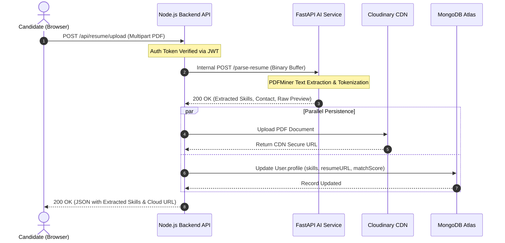
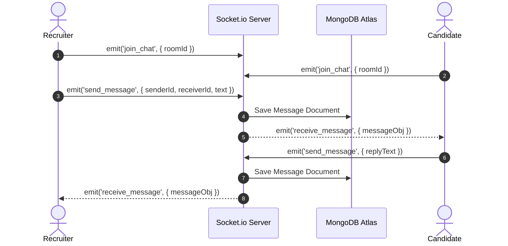

# 🏗️ System Architecture & Engineering Design

## 🌐 High-Level Topology

WorkFlow AI is architected around decoupled layers: an Edge-served Single Page Application (SPA), a centralized API Gateway and WebSocket Engine, an asynchronous NLP microservice, and managed cloud persistence.

```mermaid
graph TB
    subgraph CDN ["1. Edge Delivery (Netlify)"]
        SPA["React 19 + Vite SPA<br/>(Tailwind CSS, Redux Toolkit)"]
    end

    subgraph Compute ["2. Core API Engine (Node.js Container)"]
        Gateway["Express API Gateway"]
        AuthMid["JWT Auth & RBAC Middleware"]
        SocketServer["Socket.io Gateway (Real-Time Messages)"]
        JobCtrl["Job & Matching Controller"]
        ResumeCtrl["Resume Upload & Dispatcher"]
        
        Gateway --> AuthMid
        AuthMid --> JobCtrl
        AuthMid --> ResumeCtrl
    end

    subgraph AIMicroservice ["3. AI Intelligence Service (Python FastAPI)"]
        FastAPIApp["FastAPI Endpoint (/parse-resume)"]
        Extractor["PDFMiner Binary Text Extractor"]
        NER["Regex & Lexicon Entity Extractor"]
        
        FastAPIApp --> Extractor
        Extractor --> NER
    end

    subgraph DataLayer ["4. Cloud Data & CDN Layer"]
        Atlas[("MongoDB Atlas<br/>Users, Jobs, Applications, Messages")]
        Cloudinary["Cloudinary CDN<br/>Resumes & Media Assets"]
    end

    %% Flow connections
    SPA -->|REST HTTPS (Axios)| Gateway
    SPA <-->|Bi-directional WebSockets| SocketServer
    
    JobCtrl -->|Mongoose Queries| Atlas
    ResumeCtrl -->|Internal POST /parse-resume| FastAPIApp
    ResumeCtrl -->|Multipart Upload| Cloudinary
    ResumeCtrl -->|Update Candidate Profile| Atlas
```

---

## 🔄 Sequence Diagrams

### 1. AI Resume Parsing & Automated Ingestion


### 2. Real-Time Bi-Directional Messaging


---

## 🗄️ Database Schemas (Mongoose / MongoDB)

### `User` Collection
```typescript
{
  _id: ObjectId,
  name: String,
  email: String, // Unique, Indexed
  password: String, // Bcrypt hash
  role: "candidate" | "recruiter",
  profile: {
    skills: [String], // e.g. ["React", "Node.js", "Python"]
    resumeUrl: String, // Cloudinary asset URL
    experienceYears: Number,
    phone: String
  },
  createdAt: Date,
  updatedAt: Date
}
```

### `Job` Collection
```typescript
{
  _id: ObjectId,
  recruiterId: ObjectId, // Ref -> User
  title: String,
  company: String,
  location: String,
  type: "Full-Time" | "Part-Time" | "Contract" | "Remote",
  salary: String,
  description: String,
  requiredSkills: [String],
  applicationsCount: Number,
  createdAt: Date
}
```

### `Application` Collection
```typescript
{
  _id: ObjectId,
  jobId: ObjectId, // Ref -> Job
  candidateId: ObjectId, // Ref -> User
  resumeUrl: String,
  status: "applied" | "reviewing" | "shortlisted" | "rejected",
  appliedAt: Date
}
```

### `Message` Collection
```typescript
{
  _id: ObjectId,
  chatRoomId: String,
  sender: ObjectId, // Ref -> User
  receiver: ObjectId, // Ref -> User
  content: String,
  read: Boolean,
  createdAt: Date
}
```
