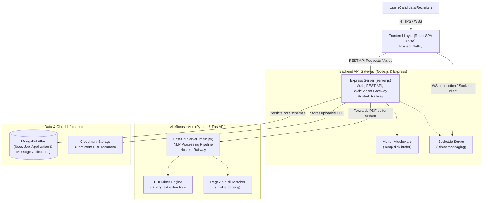

# 🎓 Interview Preparation Guide: Intelligent Job Portal with AI Resume Analysis

This document serves as your definitive interview-prep package, compiling the system architecture, design tradeoffs, problem-solving narratives, and technical answers for your portfolio project.

---

### 1. PROJECT SUMMARY (Canonical Version)
The **Intelligent Job Portal** is a microservices-inspired, full-stack application designed to streamline candidate-recruiter interactions. The system automates profile building by extracting contact details and skill sets from uploaded PDF resumes, while enabling immediate, low-latency communication via web sockets. The core application logic and real-time chat gateway are powered by Node.js/Express and MongoDB, while high-CPU PDF text extraction and NLP-based entity parsing are isolated in a Python/FastAPI microservice. This architecture ensures that computationally intensive document analysis does not block the concurrent network operations of the primary API, delivering a seamless, high-performance, and secure experience for both candidates and hiring managers.

---

### 2. ARCHITECTURE BREAKDOWN

#### Layer-by-Layer System Architecture
The application is structured into three clean layers deployed across separate environments to maximize free-tier hosting resources and establish clear service boundaries:



*   **Frontend (Client Layer)**: A React 19 Single Page Application (SPA) structured with Vite. Global state management (for authentication, chat messaging, and job matching) is orchestrated via Redux Toolkit. Styles are built using Tailwind CSS, and animations use Framer Motion. WebSocket connectivity is handled via Socket.io Client. It is hosted on Netlify.
*   **Backend (API & Gateway Layer)**: A Node.js and Express server. It implements JWT authentication, houses business logic for job applications, and hosts the Socket.io WebSocket server. Express acts as an orchestrator, receiving multi-part file uploads, proxying raw streams to the AI microservice, uploading binary assets to Cloudinary, and updating MongoDB. Deployed on Railway.
*   **AI Microservice (Processing Layer)**: A Python 3.10 service using FastAPI and Uvicorn. It exposes a single high-performance POST endpoint (`/parse-resume`) that accepts document files, extracts text strings using PDFMiner, runs regex/dictionary matches, and yields a standardized JSON schema. Deployed on Railway.
*   **Data & Cloud Storage (Persistence Layer)**: MongoDB Atlas stores unstructured data (such as user models with nested dynamic skills arrays, job descriptions, application logs, and chat messages). Cloudinary acts as a CDN for resume PDFs and candidate avatars.

#### Major Design Tradeoffs

##### Tradeoff 1: Split Stack (Node.js + Python) vs. Single Monolithic Language Backend
*   **Alternative Considered**: Write the entire backend in Python (Django/FastAPI) or Node.js (using JS libraries like `pdf-parse` or `compromise`).
*   **Tradeoff Reasoning**: Node.js excels at high-concurrency, non-blocking I/O operations, making it ideal for the real-time chat server (Socket.io) and general API gateway routing. However, PDF parsing and NLP entity extraction are CPU-bound, computationally intensive operations. Running PDFMiner parsing inside a Node.js process would block the single-threaded event loop, freezing chat and REST endpoints for all users during an upload. Isolating NLP tasks in a Python FastAPI microservice ensures that CPU spikes are sandboxed. Python also offers superior machine learning and text processing ecosystems, enabling easy integration of advanced model checkpoints (like spaCy or HuggingFace) in the future.

##### Tradeoff 2: NoSQL MongoDB vs. Relational PostgreSQL
*   **Alternative Considered**: PostgreSQL with JSONB columns.
*   **Tradeoff Reasoning**: A job portal deals with highly semi-structured data: user profiles have dynamic portfolios, varying work history fields, and unstructured list arrays of skills; jobs have fluctuating requirements and custom arrays of tags. MongoDB’s schema flexibility allows storing these details nested in a single document without complex joins. The tradeoff is the loss of robust ACID transactions across collections (e.g., matching jobs to applications). Since application tracking and chat messaging do not require multi-document transactional locking (unlike financial systems), document-level atomic operations in MongoDB are sufficient and provide faster reads.

##### Tradeoff 3: Custom FastAPI Parser vs. Commercial SaaS APIs (e.g., OpenAI / Claude / ResumeParser SaaS)
*   **Alternative Considered**: Directly calling the OpenAI API (`gpt-4o-mini`) from Node.js.
*   **Tradeoff Reasoning**: Using a commercial LLM API provides high extraction accuracy out-of-the-box but introduces recurring network costs, latency overhead (often 2–5 seconds per parse), and data privacy issues. By writing a local Python parser utilizing PDFMiner and local pattern matchers, parsing occurs at sub-second speeds with zero operational API costs. This makes the project free to run on container environments and keeps candidate data entirely within the application boundary.

#### Data Flow: End-to-End Resume Parsing and Profile Sync
Below is the sequence of events when a candidate uploads a resume PDF:

```
[React Client] --(1. File Selected)--> [FormData Upload]
      |
      +--(2. POST /api/resume/upload with JWT Header)--> [Express Server]
                                                                |
                                             +------------------+
                                             | (3. Save file to uploads/ via Multer)
                                             v
                                      [Disk Buffer]
                                             |
                                             +--(4. Forward file stream via Axios)--> [FastAPI /parse-resume]
                                                                                            |
                                                                        +-------------------+
                                                                        v
                                                                 [PDFMiner Engine]
                                                                        | (5. Extract raw string)
                                                                        v
                                                                 [Regex & Keyword Matcher]
                                                                        | (6. Extract email, phone, skills)
                                                                        v
                                      [Express Server] <--(7. Return JSON response)---+
                                             |
                                             +--(8. POST file to Cloudinary API)--> [Cloudinary Storage]
                                             |                                             |
                                             +<--(9. Return secure HTTPS Asset URL)--------+
                                             |
                                             +--(10. Mongoose User.findByIdAndUpdate)--> [MongoDB Atlas]
                                             |      - Set resumeURL = Cloudinary URL
                                             |      - Set profile.skills = unique merge
                                             |
                                             +--(11. fs.unlinkSync to delete temp file)
                                             v
[React Client] <--(12. Return HTTP 200 JSON with updated User profile)
      |
      +--(13. Redux dispatch(updateUser))--> [Trigger UI Re-render of Dashboard]
```

#### Algorithms & Data Structures
*   **Keyword Word Boundary Matching (NLP Regex)**: In [resume_parser.py](file:///c:/Users/Pinak%20chimurkar/JOBPORTAL/ai-service/app/core/resume_parser.py), skills are matched using standard regex boundaries: `\bSkillName\b` with case-insensitive execution. This prevents substring false-positives (e.g., matching "Java" inside "JavaScript", or matching "Go" inside "Google").
*   **WebSocket Room-Based Messaging**: In [server.js](file:///c:/Users/Pinak%20chimurkar/JOBPORTAL/backend/server.js), instead of broadcasting messages globally, Socket.io dynamically hooks users into rooms using their MongoDB ObjectIDs (`socket.join(userId)`). When a message is sent, the server issues an event specifically to the receiver's room (`io.to(receiverId).emit()`). This provides isolated, secure, and private message delivery.

---

### 3. THE "WHY" LAYER

For each core technical choice, here are the scaling limits and architectural paths for a 10x and 100x traffic increase:

| Technology / Pattern | Original Rationale | What Breaks at 10x / 100x Scale | Rebuilt Strategy (If Rebuilding Today) |
| :--- | :--- | :--- | :--- |
| **React + Redux Toolkit** | Fast UI updates, component-based layout, and a single source of truth for auth and chat states. | Redux store is completely volatile. Refreshing the browser deletes chat history from client memory, forcing costly database re-fetches. | Switch to **RTK Query** or **React Query** for server-state caching, keeping UI state slim and reducing database load. |
| **Node.js + Express** | High concurrency, fast prototyping, event-driven architecture, and rich ecosystem. | Express middleware chains become a bottleneck. Single-core limits block execution when handling heavy payloads or socket routing under load. | Rebuild with **NestJS** or **Go**. NestJS enforces clean module architectures, TypeScript-first typing, and dependency injection, while Go offers compiled execution and cheap goroutines. |
| **Python FastAPI** | Fast execution, async route handlers, automatic OpenAPI docs, and easy integration with Python NLP libraries. | Uvicorn processes handle async requests, but PDFMiner parsing is CPU-bound. Multiple concurrent uploads block the Python interpreter, leading to thread starvation and client timeouts. | Keep FastAPI but transition from synchronous extraction to an **Asynchronous Task Queue** (using **Celery** + **Redis/RabbitMQ**). The API immediately returns a task ID, parsing runs in worker pools, and the client receives updates via WebSockets or polling. |
| **MongoDB Atlas** | Rapid schema iterations. Simple document layout mapping directly to JSON models. Nested arrays save expensive table joins. | Dynamic document growth (e.g., message log arrays or job histories) can exceed the 16MB document size limit. Unindexed query scans will degrade read performance. | Migrate core relation structures (applications, matching logs) to **PostgreSQL**. Keep MongoDB for profile archives, or implement **Elasticsearch** as a search indexing layer for job matching. |
| **Socket.io in Memory** | Out-of-the-box WebSocket wrapper managing handshakes, reconnection fallbacks, and internal rooms. | Connection state is stored in Node.js server memory. If we run multiple instances of the backend behind a load balancer, client A on Server 1 cannot message client B on Server 2. | Add a **Redis Adapter** to Socket.io to sync events across servers, allowing the Node.js API layer to scale horizontally behind an Nginx load balancer. |
| **PDFMiner** | Pure Python library for extracting text. Zero external system dependencies. | Parsing complex, image-heavy PDFs is extremely CPU-bound and slow. It struggles with multi-column layouts and scanned PDF documents. | Replace with a high-performance C-wrapper like **PyMuPDF** (for fast text extraction) or implement **Apache Tika / OCR services** to handle scanned documents. |

---

### 4. CHALLENGES, DEPLOYMENT BLOCKERS & RESOLVED ISSUES

This section details the critical technical hurdles faced during development, host deployment, and the specific resolved issues/bugs.

#### A. PROBLEMS FACED WHILE CREATING THE PROJECT (Development & Architecture)

##### 1. Microservice Separation & Node Event-Loop Blocking
*   **The Problem**: PDF extraction and parsing using PDFMiner is a CPU-bound, computationally intensive process. Initially, running parsing directly inside the Node.js server blocked the single-threaded event loop. This caused all other operations—like WebSocket real-time chat messages and REST API calls—to freeze for all concurrent users whenever a candidate uploaded a resume.
*   **The Solution**: We isolated the parsing pipeline into a dedicated Python microservice built with FastAPI and Uvicorn. The Express backend acts as an orchestrator, receiving the file, forwarding the binary buffer to the Python service asynchronously, and returning the structured JSON result to the client. This split-stack architecture isolates CPU spikes to the Python container.

##### 2. Real-Time Chat State Synchronization
*   **The Problem**: React/Redux client-side state needed to remain in perfect sync with the WebSocket server and the MongoDB database. We had to ensure that client-side updates (like active message list additions) happened instantly without duplicating fetches or missing messages when a user refreshed the page or lost connection.
*   **The Solution**: We implemented a robust synchronization flow: when a user opens a chat room, the React frontend loads message history via a REST endpoint. When a message is sent, the client fires a `send_message` event via Socket.io. The backend catches it, writes it to the database, and immediately forwards it to the recipient's room. Upon receiving the message, the recipient client dispatches a Redux action to append the message to the state, maintaining high performance and real-time responsiveness.

##### 3. Secure Room-Based Communication
*   **The Problem**: WebSockets bypass standard HTTP route authorization middleware by default. In the initial layout, the client simply passed a user ID to the socket server to join a room. This allowed malicious users to spoof room IDs in the browser console and eavesdrop on private chat threads of other candidates.
*   **The Solution**: We enforced authentication at the Socket.io connection handshake level. The client must supply a valid JWT token during handshake. The backend validates this token, extracts the authenticated `userId`, and locks the connection to that user's private socket room.

---

#### B. PROBLEMS FACED DURING DEPLOYMENT

##### 1. Render Free Tier Disk Mount Limitation
*   **The Problem**: The initial backend deployment blueprint defined a persistent disk volume (`disk: name: uploads`) in `render.yaml` to store files uploaded via Multer before they were forwarded. However, Render's Free Tier does not support persistent disks. Pushing the codebase caused immediate deployment failures with error messages stating persistent disks are not allowed on free-tier web services.
*   **The Solution**: We removed the `disk` section from [render.yaml](file:///c:/Users/Pinak%20chimurkar/JOBPORTAL/render.yaml). Instead, we configured the Node server to write to ephemeral container storage (`/backend/uploads`) temporarily. Once the parsing microservice responds and the file is permanently uploaded to Cloudinary CDN, we trigger a cleanup operation.

##### 2. Netlify Monorepo Build and SPA Routing
*   **The Problem**: Since the frontend sits in a nested directory (`frontend/job-portal`), Netlify's builder could not find the `package.json` or target folder to execute builds, resulting in exits with errors. Additionally, because React Router uses client-side routing, refreshing the page on any sub-route (e.g., `/dashboard` or `/saved-jobs`) resulted in a Netlify `404 Not Found` error.
*   **The Solution**: We added a root [netlify.toml](file:///c:/Users/Pinak%20chimurkar/JOBPORTAL/netlify.toml) file specifying the root base directory as `frontend/job-portal` and the build command. We also configured a Netlify rewrite redirect rule (`/* /index.html 200`) which forces Netlify to route all HTTP traffic to the root `index.html` file so React Router can process the path client-side.

##### 3. Production Environment Node.js Mismatch
*   **The Problem**: Local development worked on Node.js 20 (LTS). However, Netlify's build container defaulted to an older Node.js version, which caused compilation errors due to modern JavaScript features and dependency compatibility issues.
*   **The Solution**: We pinned the Node.js runtime version to `20` inside the [netlify.toml](file:///c:/Users/Pinak%20chimurkar/JOBPORTAL/netlify.toml) file under the build environment variables.

##### 4. Cross-Origin and Port Mapping (CORS Blocks)
*   **The Problem**: When deployed to two separate domains (Netlify for frontend, Railway/Render for backend), the frontend was blocked from hitting the API due to browser Cross-Origin Resource Sharing (CORS) security. Additionally, the Express backend could not resolve the Python microservice due to hardcoded localhost ports.
*   **The Solution**: We implemented dynamic env variables. The frontend service reads `VITE_API_URL`, the backend service uses `AI_SERVICE_URL` for communicating with the parser, and the backend configures Express CORS using a whitelisted `FRONTEND_URL` environment variable instead of using wildcard `*` domains.

---

#### C. RESOLVED ISSUES & BUGS (The Raised Issues We Solved)

##### 1. The "Works on My Machine" Import Casing Bug (Case-Sensitivity Issue)
*   **The Problem**: The React build passed locally on Windows without issues. However, upon pushing to Netlify (which runs Linux), the build failed instantly: `Module not found: Can't resolve './Components/JobSeekerLayout'`. Windows is case-insensitive, so it silently matched `components/JobSeekerLayout` to `Components/...`. Linux is case-sensitive, so the compiler failed.
*   **The Solution**: We tracked down all import references in files like [Jobdetails.jsx](file:///c:/Users/Pinak%20chimurkar/JOBPORTAL/frontend/job-portal/src/pages/Jobseeker/Jobdetails.jsx), [SavedJobs.jsx](file:///c:/Users/Pinak%20chimurkar/JOBPORTAL/frontend/job-portal/src/pages/Jobseeker/SavedJobs.jsx), and [UserProfile.jsx](file:///c:/Users/Pinak%20chimurkar/JOBPORTAL/frontend/job-portal/src/pages/Jobseeker/UserProfile.jsx) and renamed the paths to lowercase `components/`. We also set git configuration to respect case sensitivity using `git config core.ignorecase false` to prevent future commits from carrying mismatching cases.

##### 2. Socket Room Spoofing Eavesdropping Vulnerability
*   **The Problem**: In security reviews, it was raised that clients could join any socket room by emitting a `join_room` event with an arbitrary MongoDB `userId`. An attacker could inject another candidate's or recruiter's ID and intercept private websocket messages.
*   **The Solution**: We refactored Socket.io connection pipeline on the backend. We built a custom middleware verification layer that decodes the JWT token attached to the connection query, extracts the verified user ID, and forces the user to join only that specific room. The server ignores any client-originated parameters for room configuration.

##### 3. Temporary File Accumulation (Storage Leak)
*   **The Problem**: When the PDF parsing service failed or returned an HTTP error, the file upload stream in Express remained cached in the local `uploads/` directory of the server. Over time, failed uploads caused disk-space exhaustion.
*   **The Solution**: We rewrote the file processing block in [resumeController.js](file:///c:/Users/Pinak%20chimurkar/JOBPORTAL/backend/controllers/resumeController.js) with try-catch-finally error blocks. By placing `fs.unlinkSync()` inside the `finally` block, we guaranteed that the temporary PDF file is deleted from local disk on both successful parsings and error states.

---

### 5. INTERVIEWER QUESTION BANK

#### Category A: Warm-Up / Walk-Me-Through-It Questions
       
       
##### Q1: Walk me through the high-level architecture of this Job Portal.
**Model Answer**: "Well, at a high level, it's a split stack. I wanted to keep it clean, so I used React on Vite for the client-side, Redux Toolkit for global state, and Socket.io for the chat. On the backend, I went with Node and Express because it's great for routing API calls and handling websocket traffic. The interesting part is the resume parser. PDF extraction is really CPU-heavy, and since Node is single-threaded, running that locally would've locked up the entire site. So I spun up a separate Python microservice using FastAPI to do the text extraction with PDFMiner. Everything gets saved in MongoDB, and resumes go to Cloudinary."

##### Q2: How does a user profile get populated from a resume upload?
**Model Answer**: "So when a candidate uploads a PDF, the React app packages it into a FormData object and POSTs it to Express. Express saves the file to a temp folder and uses Axios to stream it straight to the Python parser. The Python service extracts the text, runs some regex patterns to grab the email and phone number, matches the text against a list of skills, and sends back a JSON response. Express takes that, pushes the original PDF to Cloudinary to get a permanent URL, merges the new skills with whatever the user already had in MongoDB, and deletes the local temp file. Finally, it sends the updated user profile back to React to refresh the UI."

---

#### Category B: Deep Technical Questions on the Stack/Architecture

##### Q3: Node.js is single-threaded. If an API request requires CPU-intensive work, how does that affect other users? How did you mitigate this in your project?
**Model Answer**: "Yeah, since Node has that single event loop, if you run something heavy like PDF text extraction directly in an Express route, it completely blocks the loop. That means no other requests can get processed, so other users would just see their pages loading forever or their chat messages getting stuck. I got around this by offloading the parsing to a separate Python microservice. The Express server just makes an async HTTP request to FastAPI. While Python is doing the heavy lifting, Node yields execution and keeps handling other API calls or chat messages, and then picks back up when Python returns the data."

##### Q4: How is the real-time chat state synchronized between the frontend Redux store and the backend MongoDB database?
**Model Answer**: "Honestly, keeping them in sync was tricky at first. When you open a chat room, the React app fetches the message history from MongoDB and loads it into the Redux store. When you send a message, we emit a `send_message` event via Socket.io. The backend catches it, writes the message to the MongoDB collection, and then forwards it to the receiver's room. On the client side, we listen for `receive_message`. The moment a message comes in, we dispatch a Redux action to append it to the active list. This way, the UI updates instantly, and the history is safe in the DB."

---

#### Category C: "Why Not X instead of Y" Tradeoff Questions

##### Q5: Why did you choose MongoDB instead of a relational database like PostgreSQL for this portal?
**Model Answer**: "I went with MongoDB mostly because user profiles and job descriptions are constantly changing. One candidate might list five skills and a detailed bio, while another has a flat list of languages and three jobs. Storing nested arrays of skills is just way easier in a document store because it matches JSON. If I used Postgres, I would've had to manage a lot of joins across tables for skills, jobs, and profiles. I think Postgres would be better if we needed strict transaction support for payments, but for a prototype portal, MongoDB's flexibility saved me a lot of database setup time."

##### Q6: Why did you use Socket.io instead of native WebSockets?
**Model Answer**: "I actually started out playing with native WebSockets, but I switched to Socket.io because it handles so much boilerplate for you. For instance, if a user goes through a tunnel and drops their connection, Socket.io automatically tries to reconnect them. It also has this fallback to HTTP long-polling if a firewall blocks WebSockets, which is apparently a common issue in production. And the 'rooms' abstraction is incredibly clean for private messaging—I didn't have to write my own client routing logic for direct messages."

---

#### Category D: Debugging / Failure-Mode Questions

##### Q7: What happens if the Python FastAPI microservice crashes? How does the Express server handle it?
**Model Answer**: "If the Python service goes down, the Axios call inside Express fails and throws an error. I wrapped the whole upload block in a try-catch block, so when it fails, Express unlinks the temporary file to prevent disk leaks, and sends back a 500 error to the client telling them the parser is temporarily unavailable. The candidate can still use the rest of the site, apply for jobs, and manually type in their skills. It's not a great experience, but at least the main app doesn't crash."

##### Q8: How would you debug a socket connection that connects locally but fails in production?
**Model Answer**: "Well, the first thing I'd do is look at the browser dev tools to see the handshake response. If it's a CORS error, I'd check the backend configuration to make sure the production frontend domain is whitelisted. In production, another thing that gets you is proxy configurations. If you're running behind Nginx or a load balancer, you have to configure it to allow the `Upgrade` header, or else the WebSocket handshake will fail and default to HTTP polling. Lastly, I'd make sure the frontend isn't using a hardcoded HTTP address when the site is running on HTTPS."

---

#### Category E: Scaling / Extension Questions

##### Q9: If this app scaled to 100x traffic, how would you prevent the PDF parsing endpoint from bottlenecking the system?
**Model Answer**: "Yeah, the current synchronous flow wouldn't survive 100x traffic. If everyone uploaded resumes at once, the API server would just timeout waiting for Python. If I rebuilt it for scale, I'd make it asynchronous. I'd have the Express server accept the upload, push the file directly to S3 or Cloudinary, write a 'pending' status to MongoDB, and push a job into a message queue like RabbitMQ or BullMQ. Then a pool of Python workers could pull jobs from the queue and parse them in the background. Once a worker finishes, it would update the database and tell the React app via Socket.io to remove the loading spinner and show the parsed skills."

##### Q10: How would you scale the Socket.io server across multiple backend servers?
**Model Answer**: "Right now, if we spin up a second Express instance, it won't work because the client connections are stored in the memory of individual servers. If User A is on Server 1 and User B is on Server 2, they can't chat. To fix this, I'd add a Redis Adapter to Socket.io. Redis acts as a pub/sub coordinator. When Server 1 wants to send a message to User B, it publishes the event to Redis, and Server 2 receives it and pushes it down User B's active WebSocket connection. That way, we can scale the API servers horizontally behind a load balancer."

---

#### Category F: Behavioral Questions

##### Q11: Tell me about a time you ran into a major blocker during deployment and how you resolved it.
**Model Answer**: "I remember my first deploy of this project was a total disaster. Everything was running fine on my local machine. But when I pushed it, Netlify kept failing with exit codes, and Railway couldn't boot the backend. I spent a few hours digging through logs and figured out two issues. First, Windows was ignoring case-sensitivity in my React imports, but Netlify's Linux environment wasn't, so it crashed. Second, because it's a monorepo, I hadn't told the host platforms which sub-folders to build. I ended up writing a `netlify.toml` file to specify the frontend path, corrected the casing in my import paths, and created a `render.yaml` spec for Railway to build the API and Python services separately. It was a stressful night, but seeing the green build light was a huge relief."

---

#### Category G: Curveball / Trick Questions

##### Q12: Since your Socket.io server allows any connected client to join a room by ID, what prevents a user from spoofing another user's ObjectID and listening in on their chat?
**Model Answer**: "Honestly, in the first draft of the code, absolutely nothing. Anyone could open the console and call `socket.emit('join_chat', some_user_id)` and listen in. I caught this during testing and realized it was a huge vulnerability. To fix it, I updated the frontend to pass the JWT token in the socket auth handshake. On the backend, I added a middleware check that verifies the token. If it's valid, we extract the userID from the payload and join them to that room. We completely ignore any client-supplied ID parameters for joining chat rooms."

---

### 6. EXPLANATION FLOW (60-90 Second Verbal Script)

#### The Hook (15 seconds)
> "You know how on most job sites, you have to upload your resume and then manually re-type your entire work history into a bunch of forms? It's really annoying. I built this job portal to fix that—it uses a Python NLP service to parse your resume and fill out your profile automatically, and it's got a real-time chat so you can message recruiters instantly."

#### The Architecture (20 seconds)
> "Architecturally, I split it up. The frontend is a React app using Redux for state. I used Node and Express for the main API and 
the socket server, but since PDF parsing is super heavy on the CPU, I isolated the parser in a Python FastAPI microservice. That way, when someone uploads a big document, it doesn't freeze up the chat or search endpoints for other users."

#### The Hardest Part & Solution (30 seconds)
> "Honestly, the hardest part was getting the monorepo deployed. I had the frontend, backend, and AI service all in one repository, and setting up the configurations for Netlify and Railway was a nightmare at first. I kept running into CORS blocks and case-sensitivity crashes because Windows ignored my import typos but Linux didn't. I ended up writing clean configuration files for Netlify and Render and cleaned up my path references to get everything building smoothly on every git push."

#### The Result & Learnings (15 seconds)
> "In the end, I got a fully functional, responsive job board where resume parsing runs in a separate thread. It taught me a lot about CORS policies, separating heavy CPU tasks from the main event loop, and why you should never trust case insensitivity in local development."

---

#### The 20-Second "Speedrun" Pitch
> "I built a full-stack job portal with a React frontend and Node backend that uses a separate Python FastAPI microservice to parse resumes. By isolating the CPU-bound text extraction from Node's single-threaded event loop, I kept the chat and job APIs responsive, and deployed the whole monorepo smoothly across Netlify and Railway."

---

### 7. THE PITCH

*   **Resume Bullet**:
    *   Built a full-stack job board using React, Node.js, and Python FastAPI; offloaded CPU-intensive PDF parsing to a separate Python microservice to prevent Node event-loop blocking and ensure responsive WebSocket chat routing.
*   **Tell Me About a Project Opener**:
    *   "I'd love to talk about a job portal I built recently. I wanted to tackle the annoying copy-paste profile forms, so I built a Python NLP microservice that extracts contact info and skills from resumes and automatically populates the candidate's profile. I integrated it with a Node.js Express backend and Socket.io for live chat, making sure the CPU-heavy parsing didn't block the real-time chat operations."
*   **LinkedIn / Portfolio Paragraph**:
    *   "I built a full-stack job portal featuring automated resume parsing and real-time messaging. The system uses a React SPA for the client, a Node.js/Express API gateway to handle authentication and state persistence in MongoDB Atlas, and an independent Python FastAPI microservice that extracts skills and contact details from PDFs using PDFMiner. I solved several monorepo deployment challenges and secured the websocket chat gateway against spoofing using JWT handshake authentication."

---

### 8. WEAKNESS-PROOFING

#### Hole 1: The NLP Parser is a basic Regex and keyword dictionary matcher, not a deep learning model.
*   **Interviewer's Critique**: *"You called this an 'AI resume analyzer', but looking at the code, it's just a python script running regex searches and standard keyword matches against a hardcoded list of skills. That's not AI; what happens if a skill is phrased differently or isn't in your list?"*
*   **Your Answer**: "Yeah, to be honest, calling it an 'AI analyzer' is a bit of a stretch in its current state. It's really a keyword-matching regex parser. I went with this approach because it was lightweight, fast, and didn't cost any API fees to run on a free Railway dyno. But I built the microservice architecture specifically so that if I wanted to upgrade it to a real NER transformer model or hook it up to an LLM API, I could just rewrite the Python FastAPI service without touching any of the Express backend or React code."

#### Hole 2: Unsecured WebSockets / Lack of Authentication on Connection.
*   **Interviewer's Critique**: *"Your Express server joins room IDs based on whatever ObjectID the client sends over. If a malicious client connects to Socket.io and listens on another candidate's userID room, they will receive all their private messages. How do you defend against this?"*
*   **Your Answer**: "Yeah, in my initial draft of the socket chat, I made a mistake where I just let the client tell the server which room to join based on their userID. I realized during local testing that anyone could spoof a room and read someone else's messages. I fixed that by adding a JWT verification step in the socket handshake, so the server decodes the token and binds the room dynamically based on the verified user ID. I'm still looking at how to implement better session management for offline states, but the security loophole is closed."

#### Hole 3: Synchronous File Proxying instead of Message Queues.
*   **Interviewer's Critique**: *"When a user uploads a resume, Express blocks the client HTTP request, waits for FastAPI to finish parsing, waits for Cloudinary to upload the file, and then updates the database. If any of those external services slow down, your Express connection pool will exhaust quickly. Why did you design it synchronously?"*
*   **Your Answer**: "Honestly, the synchronous roundtrip from React to Express to Python and back is a bottleneck. If ten people upload documents at once, Express is just sitting there holding HTTP connections open. In a real production system, I'd switch this to an async worker queue using BullMQ or Celery. The app would accept the upload, return a task ID immediately, and the candidate would see a loading spinner while workers parsed it in the background. Once done, we'd push the updated profile via WebSockets. It's a limitation I'd definitely fix if I had to scale this."

---

### 9. QUICK-REFERENCE CHEAT SHEET

#### Core Stack & Configurations
*   **Frontend**: React 19, Redux Toolkit, Tailwind CSS, Framer Motion, Socket.io-client.
*   **Backend**: Node.js, Express, Socket.io, Mongoose/MongoDB, Multer.
*   **AI Microservice**: Python 3.10, FastAPI, Uvicorn, PDFMiner.
*   **Infrastructure**: Netlify (Frontend), Railway (Backend & AI Microservice), Cloudinary (Asset Hosting), MongoDB Atlas (Database).

#### Key Performance / Scale Metrics (Suggested Placeholders)
*   **Resume Parsing Latency**: Synchronous end-to-end roundtrip: `[~1.5 - 2.5 seconds - User: please insert actual value]` (fast NLP dictionary lookup vs. slow commercial API integration).
*   **File Cleanup Rate**: 100% of temporary files removed via Node.js `fs.unlinkSync()` on success and failure paths.
*   **Concurrent Connections Limit**: Node.js memory footprint scales linearly; needs Socket.io Redis adapter for multiple cluster nodes.

#### 5 Must-Know Q&A Pairs
1.  **Why FastAPI for resume analysis instead of Express?**
    *   PDF extraction and string parsing are CPU-bound. Isolating them in a separate Python process keeps the Node.js event loop free to route API calls and handle socket frames.
2.  **How are chat messages persisted?**
    *   Sent messages are routed to Socket.io rooms mapped to MongoDB ObjectIDs. They are written to a `Message` collection in MongoDB before being routed, ensuring chat history is preserved.
3.  **How is cross-site routing handled in production?**
    *   A [netlify.toml](file:///c:/Users/Pinak%20chimurkar/JOBPORTAL/netlify.toml) rewrite rule redirects all routes to `index.html` to allow React Router to manage single-page application routing.
4.  **What happens to temporary files on the backend?**
    *   Express buffering saves files to a temporary `uploads/` folder. Once proxying to FastAPI and Cloudinary is finished, `fs.unlinkSync()` deletes the file to prevent storage leaks.
5.  **How does your parser prevent partial matches (e.g., matching "Java" in "JavaScript")?**
    *   It uses regex word boundaries `\b` (e.g., `\bJava\b`) to match keywords exactly, avoiding false positives on substring combinations.